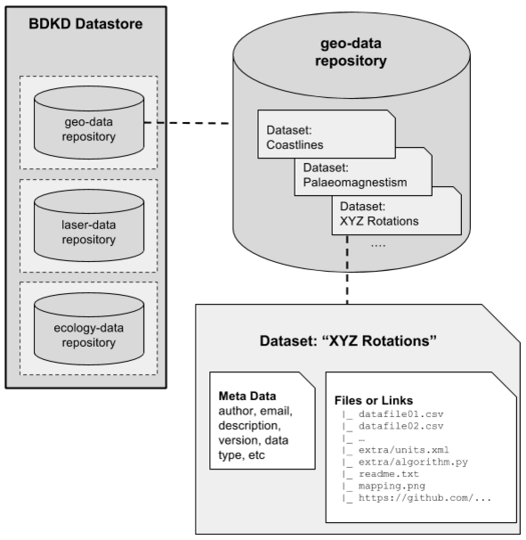

# BDKD Datastore - User Guide

## Introduction
The BDKD Data Management Guide provides a guidance on how dataset and repositories can be arranged and managed under the BDKD system.

Consider the following setup:

