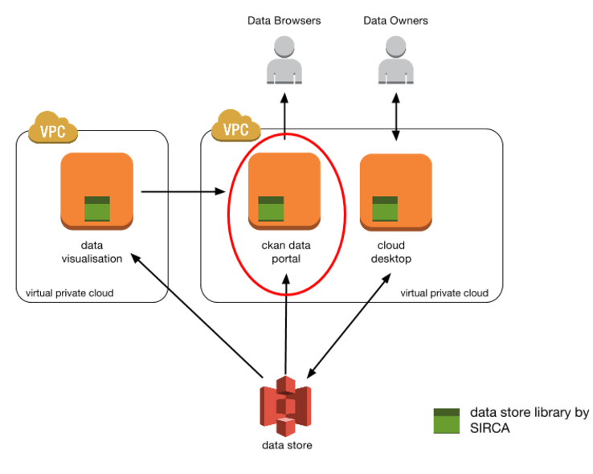

# BDKD PORTAL OPERATION GUIDE

## Introduction
This document describes how to maintain and operate a BDKD portal. It is aimed at a BDKD portal system administration, and assumes the reader to have knowledge of:
* Basic Unix administration, including software deployment
* Good understanding of cloud infrastructure, particularly Amazon Web Services, including S3, EC2, IAM, AWS Security Group, AMI, etc.
* Some AWS administration knowledge such as how to permission S3, EC2, and how to use IAM roles to control access.

## Portal Overview
The BDKD Data Portal provides a web frontend to explore and discover data that is stored behind the open science web database. Services provided by the portal include:
* Discovering and exploring datasets published by researchers
* Searching for datasets via keywords, meta data, author, dataset description, etc
* Providing meta data of the published dataset, including their descriptions, uploaded dates, data owners, etc
* Providing manifests of files that make up the published datasets
* Providing access to URL links to download files from the datasets
* Facilitating URL linkage to externally hosted sites that provide visualisation of the datasets



## I) Portal Interfaces to other BDKD components
### End Users Web Interface
The portal uses an open source data management system called CKAN, to facilitate its end user web interface for searching and discovering. End users can also use CKAN’s built-in REST API to access the portal.

### BDKD Datastore Interface
The portal is configured to query the datastore component via the BDKD datastore library. Currently the BDKD datastore uses Amazon Web Services’ (AWS) Simple Storage Service (S3) technology as an Object Storage to store data. The BDKD datastore library uses Boto (also an open source project) to gain access to S3. Access and permission from the portal to S3 is controlled via AWS Identity and Access Management (IAM) roles.

> Note that the project uses AWS as the platform to deliver a working system. If the solution is to be deployed into a different cloud computing platform such as OpenStack, the system administrator will need to know how to replace each of the AWS technology with the appropriate equivalent one (e.g. replacing AWS S3 with OpenStack Swift, replace AWS IAM with OpenStack Keystone, etc).

### Data Visualisation Sites
The CKAN portal has the ability to embed an external website inside an HTML iframe. Visualisation of a dataset is handled by the external website and the portal only provide a URL link to the external website, with the option to include an unique identifier for the dataset to be visualised. For example when exploring a dataset called “Experiment01”, which is stored in the S3 bucket “bdkd-laser-public”, the portal can render the content of an external website inside a HTML iframe that links to:
```
http://xyz_site.org/repositories/bdkd-laser-public/datasets/Experiment01
```

### External URLs for downloading files of a dataset
Although the standard CKAN installation allows dataset to be stored in the CKAN portal, in the BDKD portal, the actual files of a dataset are not setup to reside in the portal itself. Instead the files are either stored in the BDKD datastore (S3), or from an external sources that that are stored in the datastore as URL links.
To allow end users the ability to download files of a dataset stored in the S3, the S3 bucket is to be configured with public access. This way, the portal will simply provides the public URL addresses of the files to the end users so that they can download them directly from the S3 buckets.

## Key components of the Portal
Currently the BDKD portal running on an Ubuntu 14.04 box. It is made up of 3 key components:
* CKAN, an open source data management system (see http://ckan.org for details)
* BDKD Datastore Library, an open source package developed as part of the BDKD project
* Portal Data Builder, another open source package developed as part of the BDKD project


### CKAN
The CKAN data management system installed for the BDKD portal uses the following subsystems:
* PostgreSQL - an open source object-relational database system used by CKAN to store CKAN related data, such as CKAN dataset meta data, CKAN user accounts, organizations in CKAN, etc (see http://www.postgresql.org/).
* Apache Solr - an open source search platform to power the search functionality of CKAN (see http://lucene.apache.org/solr/) . The BDKD portal places Solr behind a jetty web server (see http://www.eclipse.org/jetty).
* CKAN is served behind an apache2 webserver, and connected via the modwsgi package (see https://github.com/GrahamDumpleton/mod_wsgi) 

### BDKD Datastore Library
As part of the BDKD project, the datastore library has been developed to allow users a convenient way of accessing datasets hosted in the BDKD datastore. The datastore library is distributed as a python package.

### BDKD Portal Data Builder
As the research data is hosted in the BDKD datastore using S3, the CKAN portal does not contain any actual data. Instead it only contains information extracted from the metadata of the datasets in the datastore so that it can be discovered. The process of building up the CKAN portal with meta data information is carried out by the BDKD Portal Data Builder.

Key functionalities of the Portal Data Builder are:
* Extracting meta data information from all the datasets in datastore and storing the information in the CKAN so that they can be discovered and accessed.
* Creating manifest for the files of the datasets so that they can be accessed.
* Providing URL links to the files of the datasets so that they can be downloaded
* Associating external data visualisation sites to the datasets

# II) Portal Installation and Maintenance Guide
## Launching new instances of the BDKD Portal in Amazon Web Services
The BDKD project provides default Amazon Machine Images (AMI) that can be launched as BDKD Portal servers using Amazon Elastic Computing Cloud (EC2). When the selected portal AMI is launched, it will automatically connects to the BDKD datastore and start building meta data information about the datasets found in the datastore. The procedure to launch a new BDKD Portal instance are as follow:

1. Using your AWS credentials, log into the AWS Management Console (see https://console.aws.amazon.com)
2. Select to launch a new EC2 instance using one of the following AMIs (there may be a date in the suffix of the AMI name in the format of YYYYMMDD):

> bdkd_portal_laser
* BDKD Portal to collect laser physics data
* Used by Macquarie University Department of Physics and Astronomy
* Builds data from the “bdkd-laser-public” datastore repository in AWS S3 bucket.

> bdkd_portal_geo
* BDKD Portal to collect geoscience data
* Used by University of Sydney EarthByte Group
* Builds data from the “bdkd-geophysics-public” datastore repository in AWS S3 bucket.

> bdkd_portal_eco
* BDKD Portal to collect laser physics data
* Used by Macquarie University Department of Biological Sciences
* Builds data from the “bdkd-ecology-public” datastore repository in AWS S3 bucket.

> bdkd_portal
* An empty BDKD Portal with no organization and does not build from any repository.
* Portal data builder service is installed but not enabled in this machine image.
* Good for used by new ‘organizations’ that wish to use the BDKD portal and build data from their own datastore (or buckets)

Note: if you do not have the access to syxxxxx


3. Select a suitable instance type based on the expected web traffic and datasets in the datastore. However the portal does not require great deal of power and a AWS t2.micro instance type is sufficient to drives a simple portal. 
4. Select a AWS Identity and Access Management (IAM) role that has read access to the datastore repository that is to be built from. For example in the BDKD project, to create a laser portal, the portal will use the IAM role called “bdkd-laser-public-data-role”, which is configured to have read-access to the bucket “bdkd-laser-public”. If you don’t have such a role in your AWS account, you can create one by using the following policy:
```
{
  "Version": "2012-10-17",
  "Statement": [
    {
      "Sid": "Stmt1404971319000",
      "Effect": "Allow",
      "Action": [
        "s3:GetObject",
        "s3:ListBucket"
      ],
      "Resource": [
        "arn:aws:s3:::bdkd-laser-public",
        "arn:aws:s3:::bdkd-laser-public/*"
      ]
    }
  ]
}
```
5. As the portal only contains the metadata information of the dataset rather than the actual dataset, it does not required huge amount of storage space. You can start with 8GiB and progressively increase the size as more datasets are added.
6. Select “bdkd-portal-security” for the Security Group of the instance. If you don’t have one setup yet, the portal basically requires port 80 to be opened to the world for HTTP access. Port 22 can be opened for SSH access but it is recommended to restrict this access to selective source.
7. Once the portal instance is launched, you should see the datasets appearing in the portal.

## Configuring the datastore library for the portal
Majority of the datastore configuration for the portal is controlled via the portal data builder configuration (see Configuring the portal data builder section for more details). The only configuration required for the datastore library to work, are the working and caching directories. These settings are set in the file: ```/etc/bdkd/Current/datastore.conf``` 
If you intend to manage the datastore repository using the datastore utilities (e.g. datastore-list, datastore-add), then you will also need to add the repository configuration into the same datastore.conf file. For example by adding the following lines:
```
settings:
    cache_root: /var/tmp/bdkd/cache
    working_root: /var/tmp/bdkd/working

hosts:
  s3-sydney:
    host: s3-ap-southeast-2.amazonaws.com

repositories:
  my-repo-public:
    host: s3-sydney
```
You should now be able to use the utilities (assuming the IAM role for your portal has been granted access to the bucket). Note that if you wish to add to the bucket, you will also need PUT and POST permission to the bucket/repository.

## Configuring the BDKD CKAN Portal
The BDKD portal uses pretty much a standard CKAN 2.2.1 installation other than cosmetic changes to the look and feel. Details on how to configured a CKAN portal can be found at http://docs.ckan.org. System administrators should know that CKAN for BDKD has the following setup:
* ckan config file can be found at: /etc/ckan/default/production.ini
Changing the configuration will requires both the apache2 and portal data builder services to be restarted
* apache2 as the webserver, where config file is located at: /etc/apache2/sites-enabled/ckan_default.conf
* modwsgi as the python WSGI, where the entry point can be found at: /etc/ckan/default/apache.wsgi 
* solr as the search engine, where the config files are located in: /etc/solr
* jetty as the HTTP server for solr, where the config files are located in /etc/jetty

## Configuring the portal data builder
The configuration file for the portal data builder can be found at ```/etc/bdkd/portal/builder.cfg```. In the file, you should see the following settings:
* api_key: The CKAN API key for the CKAN user account that will be used to build the meta data in CKAN. e.g.
```api_key: 12345689-abcd-1234-5678-abcdef```
* ckan_cfg: The CKAN configuration that the current CKAN instance is using. e.g. ```/etc/ckan/default/production.ini```
* ckan_url: The CKAN URL address. As the portal data builder service is currently running on the same server as CKAN, this should just be set to ```http://localhost```
* cycle_nap_in_mins: After each build cycle, the portal data builder drops into a nap to reduce CPU usage. A longer the nap time means changes in the datastore will take longer to appear in the portal. However having too short of a nap means the portal will constantly be scanning the datastore and the CKAN database for changes. Note that this is the nap time instead of the period for each cycle, so the timer will only start after a build cycle finishes. e.g. to have a 30 minutes nap, enter
```cycle_nap_in_mins: 30```
* download_template: This is the path of the HTML template file to use when generating the download page. See the section on download template for more details. e.g. ```/etc/bdkd/portal/download.html```
* build_lock_file: This is the file that will be used for exclusive lock acquisition such that no two build processes can happened at the same time. e.g. ```/tmp/portal_building```
* repos: This is a list of datastore repositories to build the CKAN data portal information from. All datasets found in each repository will be owned by exactly 1 organization in CKAN. For example:
```
repos:
  - bucket: bdkd-my-abc-bucket-public
    org_name: my-organization-abc
    org_title: My Organization ABC
    ds_host: s3-ap-southeast-2.amazonaws.com
    download_url_format: https://.../{resource_id} 
  - bucket: bdkd-my-xyz-bucket-public
    org_name: my-organization-xyz
    org_title: My Organization XYZ
    ds_host: s3-ap-southeast-2.amazonaws.com
    download_url_format: https://.../{resource_id} 
```
> Note that before dataset information can be built, the CKAN database will need to be ‘setup’ so that organizations configured here are created and ready to receive datasets information.

* repos[n].bucket: The datastore repository name (in this case the s3 bucket name). e.g. ```bdkd-geophysics-public```
* repos[n].org_name: The unique ID or name of the organization that will take the ownership of the datasets in CKAN. This is used when creating the CKAN organization during the setup stage. e.g. ```sydney-university-geoscience```
* repos[n].org_title: The title (or verbose name) of the organization as per org_name. e.g. ```University of Sydney Geoscience Dept```
* repos[n].ds_host: The hostname of the host serving the datastore repository. For example if your S3 bucket is hosted in the Sydney region, this setting will be set to ```s3-ap-southeast-2.amazonaws.com```
* repos[n].download_url_format: The string format that will take the user to a public URL that allows the files to be downloaded directly. The administrator can use the following variables in this settings: {datastore_host} -> the hostname of datastore, {repository_name} -> the name of the repository, {resource_id} -> the unique ID of the dataset. For example: ```https://{datastore_host}/{repository_name}/{resource_id}```

## Changing the Download HTML template
When the portal data builder creates the dataset download list, it uses an HTML template to generate a download page. System administrator can customize the page by changing the HTML template path set by the “download_template” key in the portal data builder configuration. By default, the path is set to /etc/bdkd/portal/download.html and it has a jinja2 template style format:
```
<html>
<body>
<font size=+1>
Repository name: {{ repository_name }}<br/>
Dataset name: {{ dataset_name }}<br/>
</font>
<ul>

 <li><a href="{{item.url}}">{{ item.name }}</a></li>

</ul>
</body>
</html>
```

* repository_name: is the datastore repository name where the dataset is found
* dataset_name: is the name of the dataset
items is a list of downloadable files in the dataset, which has 2 attributes:
* name - the name of the file or external resource
* url - the public URL address to download that file or external resource
> Note that if the template is changed after the portal data is built, a ‘reprime’ will need to be carried out.

## Starting and stopping the Portal Data Builder Service
The BDKD data portal builder is automatically started as a daemon via the Ubuntu’s upstart facility (see http://upstart.ubuntu.com for details). System administrator can customize the upstart service by updating ```/etc/init/portal_data_builder.conf```. Note that the portal data builder runs in the python virtual environment found in ```/usr/lib/ckan/bdkd/```.

To start the portal data builder service, type:
```
$ sudo start portal_data_builder
portal_data_builder start/running, process 2864
```

To stop the portal data builder service, type:
```
$ sudo stop portal_data_builder
portal_data_builder stop/waiting
```
Note: do not attempt to kill the service manually as the services is configured to respawn automatically.

## Adding a data repository as a new data source for a portal
Note that these instructions are not for adding a new dataset, but for adding a new datastore repository as a new source for a portal to build data off.

1. Log into AWS console management (https://console.aws.amazon.com) and select the AWS Simple Storage Service (S3) option.
2. Check that the bucket is there. Otherwise follow the instructions on how to add a new data repository to the BDKD system.
3. Check that the IAM role used by the portal EC2 instance has been granted “read-access” to that bucket (i.e. grant s3:GetObject and s3:ListBucket actions). If not, add the access to the policy:
```
{
  "Version": "2012-10-17",
  "Statement": [
    {
      "Effect": "Allow",
      "Action": [
        "s3:GetObject",
        "s3:ListBucket"
      ],
      "Resource": [
        "arn:aws:s3:::my-new-repo",
        "arn:aws:s3:::my-new-repo/*"
      ]
    }
  ]
}
```

4. For convenience, add the data repository to the datastore configuration file: ```/etc/bdkd/Current/datastore.conf```
```
hosts:
  s3-sydney:
  host: s3-ap-southeast-2.amazonaws.com
repositories:
  my-new-repo:
    host: s3-sydney
```
At this point you should be able to see the datastore repository as well as its datasets listing:
```
$ . /usr/lib/ckan/bdkd/bin/activate
(bdkd)$ datastore-repositories 
my-current-repo1
my-current-repo2
my-new-repo
(bdkd)$ datastore-list my-new-repo
new_dataset_1
new_dataset_2
```
5. The next step is to add the new repository to the portal data builder configuration. It is advisable to stop the portal data builder service as a precaution:
```
(bdkd)$ sudo stop portal_data_builder
portal_data_builder stop/waiting
```
6. Add the repository to the portal data builder configuration. If the datasets from this new repository is going to be owned by an existing organization, you will have to use the same org_name setting.
```
...
repos:
  - bucket: my-current-repo1
    org_name: my-current-organization1
    org_title: My Current Organization 1
    ds_host: s3-ap-southeast-2.amazonaws.com
    download_url_format: https://{datastore_host}/{repository_name}/{resource_id}
  - bucket: my-new-repo
    org_name: my-current-organization1
    org_title: My Current Organization 1
    ds_host: s3-ap-southeast-2.amazonaws.com
    download_url_format: https://{datastore_host}/{repository_name}/{resource_id}
```

7. However if you want the new datastore repository is to be owned by a new organization (or department), then provide a new org_name and org_title and re-run the setup command:
```
...
repos:
  ...
  - bucket: my-new-repo
    org_name: my-new-organization
    org_title: My New Organization
    ds_host: s3-ap-southeast-2.amazonaws.com
    download_url_format: https://{datastore_host}/{repository_name}/{resource_id}
```
Run setup to ensure the new organization is added:
```
$ . /usr/lib/ckan/bdkd/bin/activate
(bdkd)$ portal-data-builder -c /etc/bdkd/portal/builder.cfg setup
```
8. Manually run an update to prime the new data repository:
```
$ . /usr/lib/ckan/bdkd/bin/activate
(bdkd)$ portal-data-builder -c /etc/bdkd/portal/builder.cfg update
```
9. Check that the datasets in the new repository appears in the portal
10. Startup the portal data builder service again:
```
(bdkd)$ sudo start portal_data_builder
portal_data_builder start/running, process 1890
```
11. If you add a new dataset after the portal data builder service has started, you should see the new dataset appears in the portal automatically (after the configured time has passed).
12. Finally if your system allows public users to download the files from a dataset through the S3 HTTP interface, you will need to configure the bucket for the repository to allow public read access to the bucket (by granting s3:GetObject). However note that AWS charges xxxxinternet data transfer charges will be incurred by your account hence you will want to exercise this with caution. Please refer to the AWS documentation for more details.

## Adding a new Visualisation Site
Visualisation sites are websites that uses the BDKD datastore as their data source. When a dataset is added to the datastore, there is an option to assign a “data type” to the dataset. This “data type” is used by the portal data builder to determine which visualisation site will understand dataset of that type in order to display or visualise it.

Before a visualisation site is added, sysadmin should check that:
* the visualisation site is working
* the visualisation site can deal with parameters such as repository name and dataset unique ID
* a unique name for the dataset type has been assigned and agreed by the dataset data providers so that they can upload their datasets with the correct “data type”.

You can add a new visualisation site by adding an entry to the “visual-sites” section of the portal data builder’s configuration file ```/etc/bdkd/portal/builder.cfg```

Consider a new website has been developed at http://www.geoapp.bdkd.org/xmlviewer and it takes the parameter “repo=” for the repository name where a dataset is stored, and the parameter “ds=” for the name of the dataset. The site can accept dataset of “geo xml data”. The sysadmin will need to:

Add an entry to the portal data builder configuration file under visual-sites:
```
visual-sites:
  - data_type: geo data
    url: http://geodataviewer.bdkd.org/repo/{repository_name}/datasets/{resource_name}
  - data_type: geo xml data
    url: http://www.geoapp.bdkd.org/xmlviewer?repo={repository_name}&ds={resource_name}
```
Restart the builder service:
```
(bdkd)$ sudo restart portal_data_builder
```
Update the data type meta data for the datasets that is of that data type.
```
(bdkd)$ sudo restart portal_data_builder
```
See that the builder creates a new “explore” (or “visualise”) link for that dataset in the portal.

## Deploying new python packages to the portal
The portal packages are installed in the BDKD/CKAN python virtual environment so new python packages will need to be installed into the same environment. The BDKD/CKAN virtual environment can be found in the path /usr/lib/ckan/bdkd. A helper script can also be found in ```/usr/lib/ckan/bdkd/bin/activate_bash```. Packages that can be upgraded through this process include:
* CKAN
* BDKD Datastore Library
* BDKD Portal Data Builder

It is advisable that if you are upgrading core components like CKAN, datastore library or data builder, you should disable the data builder daemon and bring down the CKAN site. You can do this with the commands:
```
sudo service portal_data_builder stop
sudo service apache2 stop
```
For example, to install a new version of the BDKD portal data builder packages (from a source distribution), type:
```
sudo /usr/lib/ckan/bdkd/bin/activate_bash pip install bdkd-portal-1.3.0.tar.gz
```
Once the packages are upgraded, restart the services backup using the commands (in the order below):
```
sudo service apache2 start
sudo service portal_data_builder start
```

## Upgrading CKAN
> Notes:
This section assumes the administrator have the following knowledge:
* how to use GitHub
* how to patch (or merge) code using git
* how to build python source distribution packages
* how to activate python virtual environment
* how to install python packages from a source distribution

Currently the CKAN in the BDKD portal is based on CKAN 2.2.1. Upgrading the CKAN package is mostly like upgrading any python packages (see earlier section). However in CKAN, theming (layout and appearance of the CKAN site) is deployed as part of the package. Hence if you deployed a standard CKAN packages into the BDKD portal, you will lose the BDKD them without first patching the code.

In order not to lose the BDKD theme, the administrator will need to:
1. Get the source code for the latest (or the version) CKAN to deploy (from GitHub)
2. Apply the changes to the CKAN code from the BDKD CKAN branch (look for the branch “bdkd_ckan2.2.1”)
3. Build a new BDKD-CKAN package.
4. On the portal, activate the CKAN virtual environment and install the new BDKD-CKAN package.

## Repriming the portal’s data from the BDKD data source
The portal’s data is constantly updated by the portal data builder service. However if the data is corrupted, or a core setting for the portal or portal data builder has changed, then the system administrator might want to reprime the data.

Reasons for repriming include:
* repositories (not dataset) added or removed or updated
* visualisation data types or sites added/changed/removed
* data in the portal appears to be corrupted

The portal data builder tool provides a reprime command that purges all datasets that are in a portal and kick off a new update. The process follows:

1. SSH into the portal server and from the command prompt and activate the BDKD CKAN virtual environment:
```
$ . /usr/lib/ckan/bdkd/bin/activate
```
2. Deactivate the data builder service using the command:
```
(bdkd)$ sudo stop portal_data_builder
```
3. Execute the reprime command using the portal data builder tool:
```
(bdkd)$ portal-data-builder -c /etc/bdkd/portal/builder.cfg reprime
```

4. Reactivate the data builder service:
```
sudo start portal_data_builder
```
5. Check that new datasets are being created.

For convenience purposes, the commands used in the procedures above are listed below:
```
$ . /usr/lib/ckan/bdkd/bin/activate
(bdkd) sudo stop portal_data_builder
(bdkd)$ portal-data-builder -c /etc/bdkd/portal/builder.cfg reprime
repo1-dataset1 purged
repo1-dataset2 purged
repo1-dataset3 purged
...
(bdkd)$ sudo start portal_data_builder
```

## PostgreSQL
The CKAN system uses a PostgreSQL database system to store some of its data. As the actual research data is not stored in this PostgreSQL database, BDKD system administrator should not need concern themselves too much with the maintenance of the database. However if for any reason the sysadmin wishes to carry out some database maintenance operation for CKAN, the configurations for postgres can be found in /etc/postgresql and the CKAN database is called “ckan_default”. The administrator can switch user as “postgres” to connect to the database via the “psql” CLI tool:
```
$ sudo -u postgres psql -d ckan_default
ckan_default# \d
```
The connection setting from CKAN to PostgreSQL can be found in the CKAN configuration file, under the setting ```sqlalchemy.url```
 Go to http://www.postgresql.org/ for more information on PostgreSQL
 
## III) Troubleshooting with the Portal
### 1. Turning on logging for CKAN
When CKAN is running into issues, sysadmin can look into the CKAN logs to identify the issue. 

The default setup for BDKD has the CKAN logs information to the files:
* /var/log/apache2/ckan_default.error.log
* /var/log/apache2/ckan_default.custom.log

These settings can be found in the apache2 site configuration found in:
* /etc/apache2/sites-enabled/ckan_default.conf

The log level for apache2 is by the “LogLevel” setting in the apache configuration in:
* /etc/apache2/apache2.conf

By default, only “warnings” will be logged. However by increasing the log level for apache may not provide sysadmin with sufficient log as CKAN also has its own log level configuration in the CKAN config file:
* /etc/ckan/default/production.ini

Sysadmin may need to increase the log levels under the section ```"loggers_*"```:
```
[logger_root]
level = WARNING    # increase to INFO or DEBUG
handlers = console

[logger_ckan]
level = WARNING    # increase to INFO or DEBUG
handlers = console
qualname = ckan
propagate = 0

[logger_ckanext]
level = WARNING    # increase to INFO or DEBUG
handlers = console
qualname = ckanext
propagate = 0
```
Once the log level has changed, you will need to restart apache to propagate the changes:
```
$ sudo service apache2 restart
```

### 2. Turning on logging for the portal data builder
If the portal data builder service is not behaving as per expected, the administrator can look into the portal data builder’s log, which can be found at ```/var/log/potal_builder.log```

If the file is not there, refer to the log settings in ```/etc/bdkd/portal/logging.ini``` to see where the log file is set to.

Once the log levels have been changed, restart the portal data builder service:
```
$ sudo restart portal_data_builder
```

### 3. Locking issue
The portal data builder service attempts to acquire an exclusive lock on a lock file before carrying out its periodical datastore scan. However if for any reason the builder stops working but insist on holding an exclusive lock on the lock file, the sysadmin may intervene by manually stopping the service and removing the lock file.

1. Stop the builder service
```
$ sudo stop portal_data_builder
```

2. Confirm the lock file location
```
$ grep build_lock_file /etc/bdkd/portal/builder.cfg 
build_lock_file: /tmp/portal_building
```

3. Check that the lock file is still there after the builder service has stopped
```
$ ls /tmp/portal_building
/tmp/portal_building
```

4. Manually remove the file
```
$ rm -f /tmp/portal_building
```

5. Start up the builder service
```
$ sudo start portal_data_builder
```
By default, the lock file is located in /tmp hence an alternative is to reboot the portal machine to unlock any entangled issue.


### 4. Manually perform a build
The portal data builder service periodically scans the datastore and checks for dataset changes so that the portal can be updated. Although not required, there may be times where the sysadmin wants to manually perform the build process. 

For example:
* sysadmin wants to update the portal now instead of waiting till the next scan cycle
* sysadmin believes a dataset was not built correctly and wants to purge the dataset from the portal and rebuilds
* sysadmin wants to trace an issue with a build by manually running a build from the command prompt so that the output can be captured on the screen

It is advisable that the builder service is temporarily stopped before carrying out a manual build so that the two do not clash with each other.
```
$ sudo stop portal_data_builder
```

Activate the CKAN virtual environment:
```
$ . /usr/lib/ckan/bdkd/bin/activate
```
Run the portal data builder utility with the “update” command to kick off a manual build:
```
(bdkd)$ portal-data-builder -c /etc/bdkd/portal/builder.cfg update
```
The builder will only display errors and warnings by default so sysadmin can use the “-v” switch for verbose output, or for very detailed output use ```“--debug”```:
```
(bdkd)$ portal-data-builder -c /etc/bdkd/portal/builder.cfg update -v --debug
```
Remember to turn the builder service back on:
```
$ sudo start portal_data_builder
```

## IV) Monitoring the Cost of running a BDKD portal
The current BDKD system is deployed into AWS hence cost management is handled through the “Billing & Cost Management” section of the AWS Management Console. The key costs of running a BDKD portal include:
> BDKD Portal Server (EC2 Instance):
* Each BDKD portal consume a single EC2 instance. If different BDKD portals are created for different science streams, then each portal will be charged as a separate item.

> BDKD Portal Internal Storage (EBS Volume) -> EBS is charged by volume and varies in rates depending on the EBS storage media
* Each BDKD portal requires a certain amount of storage space for:
1. operating system and software packages
2. CKAN data storage, including meta data and search data, stored in files as well as in a relational database system
3. system and application working directories
4. system and application logs

> BDKD Portal Data Transfer (Data Transfer):

* Data transfer in/out from the portal that may incur charges, include:
1. the web pages being served by the portal to the end user
2. the meta data information downloaded from the portal website
3. internal communication between the portal and the datastore to scan for updates
4. files of the dataset being downloaded from the datastore via the URL links provided by the portal (see S3 storage items below)

* Data transfers between the portal  EC2 instances and its EBS volume should not incur any charge (e.g. access to the meta data stored in the PostgreSQL database, storage for the solr search engine, etc).

> BDKD Datastore (S3 Storage):
* The uploaded data is stored in AWS S3. There is a charge for storing the data in S3, even if the data is not being accessed. The rate varies for volume and region, but as a guide, the price of S3 storage in the Asia Pacific (Sydney) region in the month of Oct-2014, is around 3 cents per Gigabyte per month.

> BDKD Datastore ( S3 Data Transfer in/out) :
* Data is being transferred into S3 when the user uploads research data. The volume of data being transferred into the datastore is currently not charged, but the number of “PUT” or “POST” operations when uploading data, will be charged (i.e. large number of small files can incur more cost than small number of large files).

* The volume of data being transferred within the cloud is no charge if both the datastore and portal operates from within the same region. Again the number of “GET” and “LIST” operation will be charged.

* Data transferred out from datastore (S3) to the internet will incur a much higher charge. This happens when internet users download files from the dataset but it can be reconfigured to be ‘user pay’.

Please refer to AWS website at http://aws.amazon.com for more information about the pricing of each service. AWS also provides Billing Alerts that can help users monitor and manage their AWS infrastructure cost.

