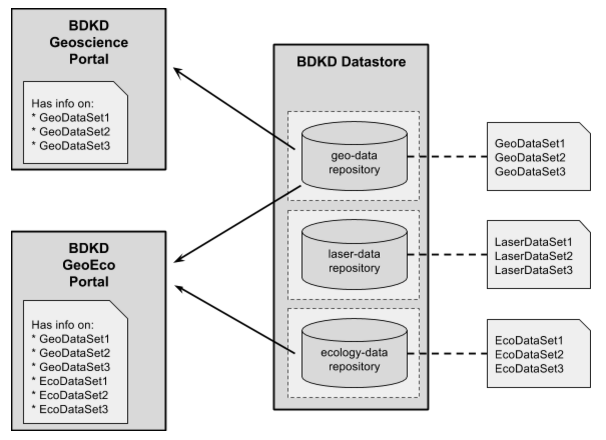

# BDKD Datastore and BDKD Portal

# Data Repositories and Datasets
The BDKD Portal provides the ability to search and explore the datasets in the datastore, and provides links to download the data files. The information in the portal is built using meta data from the datasets. A portal can be configured to build information from one or more data repositories, provided the portal has permission to view the data repositories. The same data repository can also be used to build data for different portals. Details on how to configure the portal data builder can be found in the BDKD Portal documentation

For example in the following setup, we want to setup 2 portals:

. One portal will only provide information about datasets from the geoscience repositories

. Another portal will provide information about datasets from both geoscience and ecology data repositories so that they can data from both science streams can be discovered at the same time when searching




The portal data builder’s configuration for the BDKD Geoscience Portal will be:

```
repos:
  - bucket: geo-data-repository
    org_name: university-xyz-geoscience-department
    org_title: University of XYZ Department of Geoscience
    ds_host: s3-ap-southeast-2.amazonaws.com
    download_url_format: https://{datastore_host}/{repository_name}/{resource_id}

```

But the configuration for the BDKD GeoEco Portal will contain both repositories:

```
repos:
  - bucket: geo-data-repository
    org_name: university-xyz-geoscience-department
    org_title: University of XYZ Department of Geoscience
    ds_host: s3-ap-southeast-2.amazonaws.com
    download_url_format: https://{datastore_host}/{repository_name}/{resource_id}
  - bucket: ecology-data-repository
    org_name: university-xyz-ecology-department
    org_title: University of XYZ Department of Natural Science
    ds_host: s3-ap-southeast-2.amazonaws.com
    download_url_format: https://{datastore_host}/{repository_name}/{resource_id}
```

When the explorable data is built in the portals, the Geoscience portal will only contain links to datasets from the geo-data repository, whereas in the GeoEco Portal, datasets from both repositories will be discoverable, and the datasets will be organized under different organizations.


